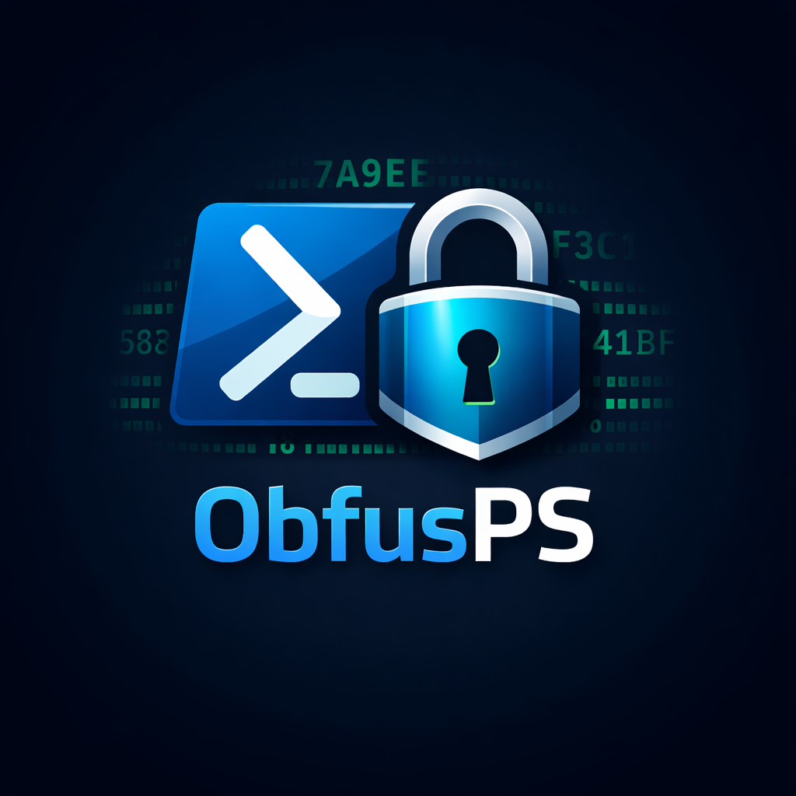
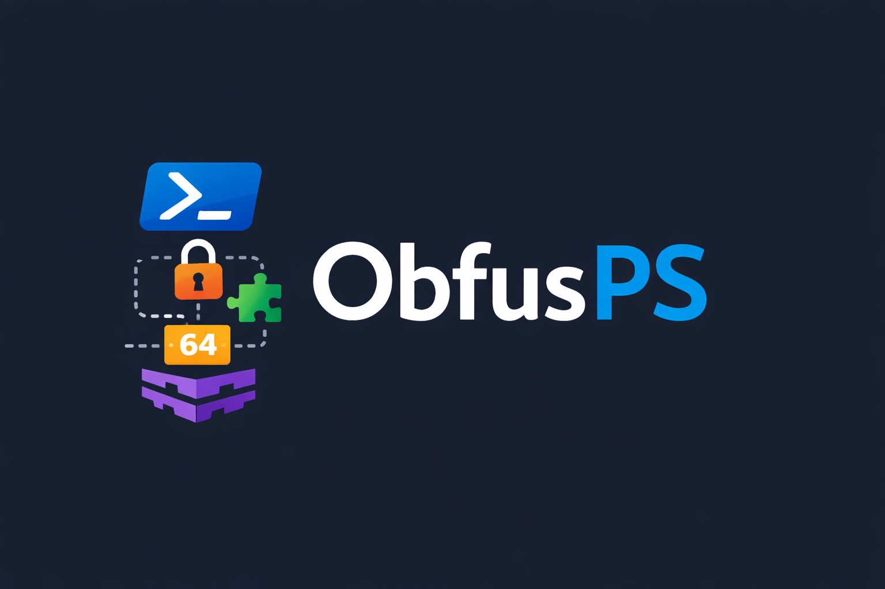

<div align="center">



# ObfusPS

### Advanced PowerShell Obfuscation Engine

**Go core** | **Smart analysis** | **650/650 validated** | **Python GUI**

[](https://go.dev/)
[](https://docs.microsoft.com/powershell/)
[](https://dotnet.microsoft.com/)
[](https://python.org/)

[](README.md#19-testing--troubleshooting)
[](https://github.com/BenzoXdev/ObfusPS)
[](https://github.com/BenzoXdev/ObfusPS)
[](README.md#21-legal--support)

*For research and authorized testing only.*

</div>

<br>

<div align="center">

</div>

<br>

> **ObfusPS** transforms PowerShell scripts into obfuscated equivalents that hinder static analysis and signature-based detection, while **guaranteeing identical runtime behavior**. Built on a zero-dependency Go binary with smart analysis, 5 encoding levels, 10 profiles, 9 pipeline transforms, and a full validation engine.

<br>

```powershell
# One command — let the engine decide everything
.\obfusps.exe -i script.ps1 -o out.ps1 -auto

# Safe mode — guaranteed identical output
.\obfusps.exe -i script.ps1 -o out.ps1 -profile safe -validate

# Maximum obfuscation
.\obfusps.exe -i script.ps1 -o out.ps1 -level 5 -profile paranoid -validate

# Analyze without transforming
.\obfusps.exe -i script.ps1 -recommend
```

---

## Table of contents

<table>
<tr>
<td width="50%" valign="top">

**Getting started**
1. [Why ObfusPS?](#1-why-obfusps)
2. [Quick start](#2-quick-start)
3. [Prerequisites & installation](#3-prerequisites--installation)
4. [Running (CLI / Batch / Python GUI)](#4-running-cli--batch--python-gui)

**Core concepts**
5. [Architecture](#5-architecture)
6. [Obfuscation levels (1-5)](#6-obfuscation-levels-1-5)
7. [Pipeline transforms](#7-pipeline-transforms)
8. [Profiles](#8-profiles)
9. [Smart mode (`-auto`, `-recommend`)](#9-smart-mode--auto---recommend)

</td>
<td width="50%" valign="top">

**Reference**
10. [Complete CLI options](#10-complete-cli-options)
11. [Validation (`-validate`)](#11-validation--validate)
12. [Fragmentation & integrity](#12-fragmentation--integrity)
13. [Encoding & execution model](#13-encoding--execution-model)
14. [Metrics & reporting](#14-metrics--reporting)

**Quality & safety**
15. [Safety mechanisms](#15-safety-mechanisms)
16. [Best practices](#16-best-practices)
17. [Verified scenarios](#17-verified-scenarios)
18. [Path fallback & scriptblock](#18-path-fallback--scriptblock-compatibility)
19. [Testing & troubleshooting](#19-testing--troubleshooting)
20. [Project structure & API](#20-project-structure--api)
21. [Legal & support](#21-legal--support)
22. [Changelog](#22-changelog)

</td>
</tr>
</table>

---

## 1. Why ObfusPS?

<table>
<tr>
<td width="60">

**5**
</td>
<td>

**Encoding levels** — from simple char-join to GZip+XOR+fragmentation with structural polymorphism
</td>
</tr>
<tr>
<td>

**10**
</td>
<td>

**Profiles** — safe, light, balanced, heavy, stealth, paranoid, redteam, blueteam, size, dev
</td>
</tr>
<tr>
<td>

**9**
</td>
<td>

**Pipeline transforms** — iden, strenc, stringdict, numenc, fmt, cf-opaque, cf-shuffle, dead, anti-reverse
</td>
</tr>
<tr>
<td>

**22+**
</td>
<td>

**Smart detectors** — auto-analyze scripts, recommend settings, auto-retry on failure
</td>
</tr>
<tr>
<td>

**650**
</td>
<td>

**Validated combinations** — 13 scripts x 5 levels x 10 profiles, all passing with byte-identical output
</td>
</tr>
<tr>
<td>

**0**
</td>
<td>

**Runtime dependencies** — single Go binary, no CGo, cross-platform
</td>
</tr>
</table>

### Design goals

| Goal | How |
|------|-----|
| **Behavioral fidelity** | `-validate` compares stdout, stderr, exit code. `-profile safe` = identical output guaranteed |
| **Research & education** | Study obfuscation techniques in academic and professional contexts |
| **Authorized red/blue team** | Test AV/EDR/AMSI resilience with reproducible builds (`-seed N`) |
| **IP protection** | Protect internal PowerShell scripts from reverse engineering |
| **Intelligence** | `-auto` analyzes scripts and selects optimal settings; `-auto-retry` on failure |
| **Clean architecture** | Go engine produces text only — all runtime behavior lives in generated PowerShell stubs |

---

## 2. Quick start

```bash
# Clone and build
git clone https://github.com/BenzoXdev/ObfusPS.git
cd ObfusPS
go build -o obfusps.exe ./cmd/obfusps

# Smart mode — let the engine analyze and decide
./obfusps.exe -i script.ps1 -o out.ps1 -auto

# Safe + validated
./obfusps.exe -i script.ps1 -o out.ps1 -profile safe -validate

# Maximum obfuscation + validation
./obfusps.exe -i script.ps1 -o out.ps1 -level 5 -profile paranoid -validate -validate-stderr ignore

# Analyze only (no transformation)
./obfusps.exe -i script.ps1 -recommend

# Custom pipeline
./obfusps.exe -i script.ps1 -o out.ps1 -level 5 -pipeline "iden,strenc,numenc" -iden obf -strenc rc4 -numenc

# Help & docs
./obfusps.exe -h
./obfusps.exe -docs
```

| Environment | Supported | Notes |
|-------------|-----------|-------|
| PowerShell 5.1 | Yes | Avoid PS7-only syntax. Emojis via `[char]::ConvertFromUtf32` at level 1 |
| PowerShell 7.x | Yes | Better UTF-8/ANSI support |
| Windows | Yes | CLI + Batch + Python GUI |
| Linux / macOS | Yes | CLI only |

---

## 3. Prerequisites & installation

| Prerequisite | Version | Required | Usage |
|-------------|---------|----------|-------|
| **Go** | 1.24+ | Yes | Core engine |
| **PowerShell** | 5.1 or 7.x | Yes | Script runtime, AST with `-use-ast` |
| **.NET SDK** | 8.0+ | Optional | C# AST parser (Windows without pwsh) |
| **Python** | 3.x | Optional | GUI, test harness |
| **colorama** | latest | Optional | Terminal colors for Python GUI |

**From source (recommended):**

```bash
git clone https://github.com/BenzoXdev/ObfusPS.git
cd ObfusPS
go build -o obfusps.exe ./cmd/obfusps
```

**Install via Go:**

```bash
go install github.com/benzoXdev/obfusps/cmd/obfusps@latest
```

<details>
<summary><b>Python GUI setup</b></summary>

```bash
pip install -r requirements-tool.txt
# or simply:
pip install colorama
```

Then run `ObfusPS.bat` or `python ObfusPS-Tool.py`.

**Build as standalone EXE:**

```batch
build-ObfusPS-Tool.bat
:: or manually:
pip install pyinstaller colorama
pyinstaller --onefile --console --icon=docs/ObfusPS.ico --name ObfusPS-Tool ObfusPS-Tool.py
```

</details>

<details>
<summary><b>C# AST parser setup (optional, Windows)</b></summary>

```batch
build-PSAstParser.bat
:: or manually:
cd scripts\PSAstParser
dotnet publish -c Release -r win-x64 --self-contained false -o ..\..\build\PSAstParser
```

</details>

### Downloads

| Component | Link |
|-----------|------|
| **Go 1.24+** | [go.dev/dl](https://go.dev/dl/) |
| **.NET SDK 8.0** | [dotnet-sdk-8.0.417](https://builds.dotnet.microsoft.com/dotnet/Sdk/8.0.417/dotnet-sdk-8.0.417-win-x64.exe) |
| **Python 3** | [python.org](https://python.org/downloads/) |
| **PowerShell 7** | [GitHub releases](https://github.com/PowerShell/PowerShell/releases) |

---

## 4. Running (CLI / Batch / Python GUI)

### CLI

```bash
# Standard
obfusps -i <input.ps1> -o <output.ps1> -level <1-5> [options]

# Layer-based
obfusps build -i <input.ps1> -layers AST,Flow,Encoding,Runtime -profile stealth -o <output.ps1>

# Stdin/stdout pipeline
Get-Content script.ps1 | obfusps -stdin -stdout -level 5 -q > out.ps1
```

### Batch (Windows)

`ObfusPS.bat` checks Python/colorama and runs `ObfusPS-Tool.py`.

### Python GUI — 4 modes

| Mode | Key | Description |
|------|-----|-------------|
| **AUTO** | `0` / `A` | Smart mode: engine auto-detects best settings via `-auto -auto-retry` |
| **MANUAL** | `M` | Choose level (1-5), profile (1-10), optional AST and validation |
| **RECOMMEND** | `R` | Analyze script and print recommendations without obfuscating |
| **COMMAND** | `C` | Raw CLI: type any `obfusps` command with full flags (advanced users) |

Features: file picker or comma-separated paths, colored output, progress tracking, error hints, backup of input files. Output in `ObfusPS/Script-Obfuscate/`.

---

## 5. Architecture

### Multi-language design

| Technology | Role | Why |
|------------|------|-----|
| **Go 1.24+** | Core engine: parsing, pipeline, packers, RNG, I/O | Single binary, fast, cross-platform, zero dependency |
| **PowerShell** | Script runtime + native AST parser | Official AST via `System.Management.Automation.Language` |
| **C# / .NET 8** | AST fallback parser | AST on Windows without pwsh (CI/build) |
| **Python 3** | GUI, test harness, packaging | Rapid prototyping, accessible UI |

> **The Go engine never embeds PowerShell logic.** All runtime behavior lives in generated stubs. The engine produces text; it does not interpret or execute PowerShell. Important for audits.

### Engine flow

```
INPUT (.ps1)
    |
    v
+------------+     +---------------------------------------------+
| Read &     |     | SMART ANALYSIS (-auto / -recommend)          |
| Validate   |     |   AnalyzeScript(): 22+ feature detectors    |
| UTF-8      |     |   -> Complexity score (0-100)                |
+-----+------+     |   -> Recommended profile, level, flags      |
      |             |   -> Warnings & suggestions                 |
      v             +----------------------+----------------------+
+------------+                             |  (-auto applies)
| Seed       |                             v
| Derive     |     +---------------------------------------------+
+-----+------+     | PIPELINE TRANSFORMS (in order)              |
      |             |   iden -> strenc -> stringdict -> numenc     |
      v             |   -> fmt -> cf-opaque -> cf-shuffle -> dead |
+------------+     +----------------------+----------------------+
| Optional   |                             |
| -log       |                             v
+-----+------+     +---------------------------------------------+
      |             | PACKER (level 1-5)                          |
      v             |   char join | Base64 | GZip | GZip+XOR+frag|
+------------+     +----------------------+----------------------+
| Assembly   |                             |
| stub +     |                             v
| signature  |     +---------------------------------------------+
| + seed     |     | VALIDATE (-validate)                        |
+-----+------+     |   Run original & obfuscated -> compare      |
      |             |   stdout, stderr, exit code                 |
      v             |   Auto-retry on failure (-auto-retry)       |
OUTPUT (.ps1)       +---------------------------------------------+
```

### Cryptographic algorithms

| Algorithm | Role | Details |
|-----------|------|---------|
| **SHA-256** | Seed derivation & integrity | 8 first bytes for seed; 4-byte integrity hash (level 5) |
| **LCG** | XOR key derivation | `seed * 1103515245 + 12345` — identical in Go & PS |
| **XOR (32 bytes)** | Payload encryption (level 5) | Byte-by-byte with LCG-derived key |
| **RC4** | String encryption (pipeline) | 256-byte S-box, keystream XOR |
| **GZip** | Compression | Levels 4-5 via `IO.Compression.GzipStream` |
| **Fisher-Yates** | Shuffle | Fragment order & function blocks |

---

## 6. Obfuscation levels (1-5)

Each level wraps the (optionally transformed) script in a different **packer**:

| Level | Name | Technique | Resistance |
|-------|------|-----------|------------|
| **1** | Char Join | Unicode codepoints via `[char]::ConvertFromUtf32`, join, scriptblock | Low |
| **2** | Base64 | UTF-8 to Base64, `[Convert]::FromBase64String`, decode, execute | Low |
| **3** | Base64 + Var | Intermediate variable for 2-step decode | Low |
| **4** | GZip + Base64 | GZip compress, Base64, MemoryStream, GzipStream, StreamReader | Medium |
| **5** | GZip + XOR + Frag | GZip, XOR 32-byte key, Base64, up to 256 fragments, Fisher-Yates shuffle, 3 polymorphic templates + decoy vars | High |

---

## 7. Pipeline transforms

Transforms are applied **before** the packer, in this order:

```
Source --> iden --> strenc --> stringdict --> numenc --> fmt --> cf-opaque --> cf-shuffle --> dead --> Packer --> Output
```

| Transform | Flag | What it does |
|-----------|------|--------------|
| **iden** | `-iden obf` | Rename variables and functions (reserved vars protected) |
| **strenc** | `-strenc xor/rc4` | Encrypt string literals byte-by-byte |
| **stringdict** | `-stringdict 0..100` | Split strings into token array |
| **numenc** | `-numenc` | Replace numbers with arithmetic/bitwise expressions |
| **fmt** | `-fmt jitter` | Inject random whitespace |
| **cf-opaque** | `-cf-opaque` | Wrap code in always-true predicates |
| **cf-shuffle** | `-cf-shuffle` | Reorder contiguous function groups |
| **dead** | `-deadcode 0..100` | Inject dead branches, decoy functions |
| **anti-reverse** | `-anti-reverse` | Exit if debugger detected |

### Layer system

`-layers` provides a high-level shortcut that configures pipeline + level automatically:

| Layer | Enables | Level |
|-------|---------|-------|
| **AST** | iden (obf), context-aware, module-aware | 3 |
| **Flow** | cf-opaque, cf-shuffle, deadcode 15 | 2 |
| **Encoding** | stringdict 30, strenc xor, numenc, fmt jitter | 4 |
| **Runtime** | anti-reverse, level 5 | 5 |

Combine freely: `-layers AST,Encoding,Runtime`

---

## 8. Profiles

10 presets from zero-transform to maximum obfuscation:

| Profile | StrEnc | StringDict | DeadCode | Frag | Iden | Anti-Rev | FlowSafe | Best for |
|---------|--------|------------|----------|------|------|----------|----------|----------|
| **safe** | off | 0 | 0 | --- | keep | no | yes | Production — identical output guaranteed |
| **light** | off | 0 | 0 | tight | keep | no | yes | Minimal, fast, compatible |
| **balanced** | xor | 30 | 10 | medium | keep | no | yes | Default — good mix |
| **heavy** | rc4 | 50 | 25 | loose | obf | no | yes | Strong — RC4, renaming |
| **stealth** | rc4 | 40 | 15 | pro | obf | no | yes | Evasion — random seed, polymorphic |
| **paranoid** | rc4 | 60 | 30 | pro | obf | yes | no | Maximum — all transforms |
| **redteam** | rc4 | 50 | 25 | pro | obf | yes | no | Red team ops — anti-debug |
| **blueteam** | xor | 30 | 10 | medium | keep | no | yes | Blue team audit — deterministic |
| **size** | off | 0 | 0 | tight | keep | no | yes | Minimize output size |
| **dev** | off | 0 | 0 | --- | keep | no | yes | Debug — easy inspection |

> Explicit flags always override profile defaults. Example: `obfusps -profile safe -iden obf` enables renaming even in safe mode.

---

## 9. Smart mode (`-auto`, `-recommend`)

### `-recommend` — analyze without transforming

Scans the script with **22+ feature detectors** and prints detected features, complexity score (0-100), recommended profile/level, warnings, and suggestions.

```bash
obfusps -i complex-script.ps1 -recommend
```

### `-auto` — smart auto-detection

| Script complexity | Profile | Level | Auto flags |
|-------------------|---------|-------|------------|
| Low (0-15) | balanced | 5 | --- |
| Medium (16-35) | heavy | 5 | --- |
| High (36-60) | heavy | 4 | `-context-aware -use-ast` |
| Very high (60+) | balanced | 4 | `-context-aware -use-ast -validate -auto-retry` |

Smart flags enabled automatically:
- **Dynamic invoke** (IEX) -> `-context-aware -use-ast`
- **Module patterns** -> `-module-aware`
- **Complexity >= 50** -> `-validate -auto-retry`

### `-auto-retry` — progressive fallback

When `-validate` fails, automatically retries up to 5 times with progressively safer settings (lower level, safer profile) until validation passes.

---

## 10. Complete CLI options

<details>
<summary><b>Input / Output</b></summary>

| Option | Type | Default | Description |
|--------|------|---------|-------------|
| `-i` | string | --- | Input `.ps1` file |
| `-o` | string | `obfuscated.ps1` | Output file |
| `-stdin` | bool | false | Read from stdin |
| `-stdout` | bool | false | Write to stdout |
| `-noexec` | bool | false | Emit payload only (no IEX wrapper) |
| `-q` | bool | false | Quiet mode |

</details>

<details>
<summary><b>Obfuscation settings</b></summary>

| Option | Type | Default | Description |
|--------|------|---------|-------------|
| `-level` | 1..5 | 1 | Packer level |
| `-profile` | string | --- | Preset (safe/light/balanced/heavy/stealth/paranoid/redteam/blueteam/size/dev) |
| `-pipeline` | csv | --- | Custom transforms |
| `-layers` | csv | --- | High-level (AST/Flow/Encoding/Runtime) |

</details>

<details>
<summary><b>Pipeline transforms</b></summary>

| Option | Type | Default | Description |
|--------|------|---------|-------------|
| `-iden` | keep/obf | keep | Identifier renaming |
| `-strenc` | off/xor/rc4 | off | String encryption |
| `-strkey` | hex | --- | Hex key for strenc |
| `-stringdict` | 0..100 | 0 | String tokenization % |
| `-numenc` | bool | false | Number encoding |
| `-fmt` | off/jitter | off | Format jitter |
| `-cf-opaque` | bool | false | Opaque predicates |
| `-cf-shuffle` | bool | false | Function reorder |
| `-deadcode` | 0..100 | 0 | Dead code injection % |
| `-anti-reverse` | bool | false | Anti-debug checks |
| `-flow-unsafe` | bool | false | Disable FlowSafeMode |

</details>

<details>
<summary><b>Smart mode & Validation</b></summary>

| Option | Type | Default | Description |
|--------|------|---------|-------------|
| `-auto` | bool | false | Auto-detect best settings |
| `-auto-retry` | bool | false | Retry with safer settings on failure |
| `-recommend` | bool | false | Analyze only |
| `-validate` | bool | false | Compare original vs obfuscated output |
| `-validate-args` | string | "" | Args for validation |
| `-validate-stderr` | strict/ignore | strict | stderr comparison mode |
| `-validate-timeout` | int | 30 | Timeout (seconds) |

</details>

<details>
<summary><b>Fragmentation, seed & utilities</b></summary>

| Option | Type | Default | Description |
|--------|------|---------|-------------|
| `-frag` | string | --- | Fragment profile (tight/medium/loose/pro) |
| `-minfrag` | int | 10 | Min fragment size |
| `-maxfrag` | int | 20 | Max fragment size |
| `-no-integrity` | bool | true | Disable integrity check |
| `-seed` | int64 | hash | Fixed RNG seed |
| `-fuzz` | int | 0 | Generate N variants |
| `-report` | bool | false | Obfuscation report |
| `-dry-run` | bool | false | Analyze only |
| `-log` | string | --- | Debug log file |
| `-docs` | bool | false | Golden rules |
| `-context-aware` | bool | false | Protect IEX/Add-Type strings |
| `-module-aware` | bool | false | Protect module exports |
| `-use-ast` | bool | false | Native PowerShell AST |
| `-version` | bool | false | Version info |

</details>

> **Deprecated:** `-varrename` is kept for backward compatibility — use `-iden obf` instead.

---

## 11. Validation (`-validate`)

Runs the original and obfuscated scripts, then compares:

| What | Criteria |
|------|----------|
| **stdout** | Byte-for-byte identical |
| **stderr** | Byte-for-byte identical (or ignored with `-validate-stderr ignore`) |
| **Exit code** | Must match |

Both scripts execute under identical UTF-8 encoding conditions.

```bash
# Strict
obfusps -i script.ps1 -o out.ps1 -profile balanced -validate

# Lenient (ignore stderr)
obfusps -i script.ps1 -o out.ps1 -profile heavy -validate -validate-stderr ignore

# Custom args + timeout
obfusps -i script.ps1 -o out.ps1 -validate -validate-args "-Name test" -validate-timeout 60
```

---

## 12. Fragmentation & integrity

### Fragmentation profiles (level 5)

| Profile | minFrag | maxFrag | Use case |
|---------|---------|---------|----------|
| **tight** | 6 | 10 | Small scripts, max fragments |
| **medium** | 10 | 18 | Default balance |
| **loose** | 14 | 28 | Large scripts |
| **pro** | 5 | 14 | Maximum disruption |

- Max **256 fragments**, auto-scaled for large scripts
- Custom: `-minfrag 4 -maxfrag 8`

### Integrity check

When `-no-integrity=false`: SHA-256 hash (4 bytes) of payload verified at runtime. Disabled by default for reliability.

---

## 13. Encoding & execution model

| Aspect | Detail |
|--------|--------|
| **Input** | UTF-8 only (file or stdin) |
| **Output** | UTF-8 with BOM (EF BB BF) |
| **Preamble** | Sets `[Console]::OutputEncoding` and `$OutputEncoding` to UTF-8 |
| **Footer** | `# ObfusPS by BenzoXdev | seed=N` |
| **Execution** | `& ([scriptblock]::Create($var)) @args` — arguments pass through |

---

## 14. Metrics & reporting

After obfuscation the engine prints:

```
Metrics: size=12345 bytes | unique=87 | entropy=4.52 | alnum_ratio=0.71 | ratio=2.3x | lines=2
```

| Metric | Description |
|--------|-------------|
| **size** | Output size in bytes |
| **unique** | Unique characters |
| **entropy** | Shannon entropy (bits/char) |
| **alnum_ratio** | Alphanumeric ratio |
| **ratio** | Output/input size ratio |
| **lines** | Line count |

Use `-report` for a detailed report. Use `-dry-run` to analyze without transforming.

---

## 15. Safety mechanisms

ObfusPS implements **30+ protections** to ensure obfuscated scripts remain functionally identical.

### String protection

| Protection | Description |
|------------|-------------|
| **Here-string preservation** | `@'...'@` and `@"..."@` excluded from all transforms |
| **Attribute argument** | `[Alias('Name')]`, `[ValidateSet(...)]` strings never tokenized |
| **Context-aware** | IEX, Add-Type, ScriptBlock::Create strings never encrypted |
| **Interpolation detection** | DQ strings with `$var` or `$(expr)` excluded from strenc |
| **Backtick escape** | DQ strings with `` `n ``, `` `t ``, `` `$ `` excluded from strenc |
| **Nested quote detection** | SQ patterns inside DQ strings correctly identified |
| **Subexpression safety** | `$(...)` content excluded from stringdict/strenc |

### Identifier protection

| Protection | Description |
|------------|-------------|
| **Reserved variables** | `$args`, `$null`, `$true`, `$false`, `$_`, `$input`, `$this`, `$PSScriptRoot`, `$MyInvocation`, `$PSCmdlet`, `$Error`, `$env:*`, `$using:*`, etc. |
| **Scoped variables** | `$script:`, `$global:`, `$local:`, `$private:` — prefix preserved, base name renamed consistently |
| **Class properties** | `$this.Property`, enums, static members, class parameters all protected |
| **Splatting sync** | `@var` renamed with `$var` |
| **Braced variable sync** | `${var}` renamed with `$var` |
| **Method/static protection** | `.Method()` and `::Method()` never treated as function names |
| **Module-aware** | `Export-ModuleMember` functions protected |

### Number & control flow protection

| Protection | Description |
|------------|-------------|
| **Scientific notation** | `4.56e-7`, `1e+3` preserved |
| **Decimal / hex** | `3.14`, `0xFF` preserved |
| **Negative arguments** | `-3` wrapped as `(-encoded)` |
| **Redirections** | `2>&1` preserved |
| **FlowSafeMode** | try/catch/trap blocks excluded from CF/dead transforms |
| **Safe cf-shuffle** | Only contiguous function groups shuffled |

---

## 16. Best practices

### Golden rules

1. **Start with `-profile safe -validate`** to verify your script works
2. **Use `-auto`** when unsure about settings
3. **Always use `-validate`** for critical scripts
4. **Add path fallback** if using `$PSScriptRoot` or `$MyInvocation.MyCommand.Path`
5. **Use `$script:variable`** for shared state in closures
6. **Use `-context-aware -use-ast`** for scripts with IEX, Add-Type
7. **Use `-module-aware`** for `.psm1` module files
8. **Test on both PS 5.1 and 7.x** if using emojis/ANSI
9. **Don't re-save** obfuscated files in another encoding
10. **Use `-seed N`** for deterministic builds in CI/CD

### Recommended commands

```bash
# Production (safe, validated)
obfusps -i script.ps1 -o out.ps1 -profile safe -validate

# Smart auto (auto-everything)
obfusps -i script.ps1 -o out.ps1 -auto -auto-retry

# Modules
obfusps -i module.psm1 -o out.psm1 -profile balanced -module-aware -use-ast -validate

# Dynamic code
obfusps -i tool.ps1 -o out.ps1 -profile heavy -context-aware -use-ast -validate

# Red team
obfusps -i payload.ps1 -o out.ps1 -profile redteam -level 5 -anti-reverse

# Fuzz (10 variants)
obfusps -i script.ps1 -o out.ps1 -level 5 -profile stealth -fuzz 10

# Reproducible CI build
obfusps -i script.ps1 -o out.ps1 -level 5 -seed 42 -q
```

---

## 17. Verified scenarios

All scenarios below have been tested across **all 5 levels and all 10 profiles** with `-validate`:

| Category | What was verified |
|----------|-------------------|
| **Base64 & encoding** | `[Convert]::ToBase64String`, nested Base64, `FromBase64String` roundtrips |
| **Compression** | GZip compress/decompress via `IO.Compression.GzipStream` |
| **Encryption** | AES (`RijndaelManaged`), XOR cipher, RC4, `SecureString` |
| **Hashing** | SHA-256, SHA-512, MD5, SHA-1 |
| **Encoding conversions** | Hex, Base64, UTF-8, ASCII, Unicode |
| **Tokens** | JWT-like construction, PEM block generation |
| **Add-Type / C#** | C# code with Base64 source, .NET generics, reflection |
| **Webhooks** | Discord `Invoke-RestMethod` with JSON/Base64 payload |
| **Scoped variables** | `$script:`, `$global:`, `$local:`, `$private:` consistency |
| **Classes & enums** | Properties, methods, `$this.X`, `Hidden`, `Static`, `[Enum]::Value` |
| **Strings** | Here-strings (SQ/DQ), interpolation, subexpressions, backtick escapes, string multiply |
| **Unicode / emojis** | Codepoints > 65535, `ConvertFromUtf32`, ANSI escape codes |
| **Dynamic code** | `Invoke-Expression`, `ScriptBlock::Create`, splatting |
| **I/O & error handling** | File operations, `using` directives, `CmdletBinding`, try/catch/trap |

---

## 18. Path fallback & scriptblock compatibility

Obfuscated scripts run inside a scriptblock, so `$PSScriptRoot` may be empty. Add a fallback:

```powershell
$script:RootPath = try {
    $p = $MyInvocation.MyCommand.Path
    if ($p) { Split-Path -Parent $p } else { (Get-Location).Path }
} catch {
    (Get-Location).Path
}
```

Use `$script:variable` instead of local variables for shared state in closures.

---

## 19. Testing & troubleshooting

### Test matrix

| Test | Description | Count |
|------|-------------|-------|
| **Unit tests** | `go test ./internal/engine/ -v` | Core engine |
| **Full matrix** | 13 scripts x 5 levels x 10 profiles with `-validate` | **650** |
| **Layer combos** | All permutations of AST, Flow, Encoding, Runtime | 15 |
| **Pipeline combos** | Individual + complex transform combinations | 35+ |
| **Extreme scripts** | 3000+ lines, Base64/AES/JWT/PEM, webhooks, XAML, .NET generics, Unicode | Edge cases |

**Status: 650/650 passing** — zero regressions.

### Troubleshooting

| Issue | Solution |
|-------|----------|
| "file is empty" | Check path and file size |
| "not valid UTF-8" | Save source as UTF-8 |
| Obfuscated does nothing | Use `-no-integrity` (default) |
| Different results | Use `$script:var` in closures; add path fallback |
| `stdout differs` | Use `-validate-stderr ignore` |
| Exit code 9 / 99 | Add path fallback (section 18) |
| obfusps not found | Build from source or add GOPATH/bin to PATH |
| Slow / hanging | Use `-validate-timeout` |
| IEX / Add-Type issues | Add `-context-aware -use-ast` |
| Module file (.psm1) | Add `-module-aware` |
| Classes / enums | Automatic protection; use `-auto` for complex scripts |
| Base64 / crypto | Works out of the box |
| Webhooks / HTTP | Use `-validate-stderr ignore` if endpoint unreliable |
| Emojis / Unicode | Works; level 1 uses `ConvertFromUtf32` for PS 5.1 |

---

## 20. Project structure & API

### Project structure

```
ObfusPS/
|
+-- cmd/obfusps/
|       main.go                     # CLI entry point
|
+-- internal/engine/                # Core engine (16 files)
|       analyze.go                  # Script analysis (22+ detectors)
|       ast.go                      # AST integration (native + C# fallback)
|       banners.go                  # CLI banner, colors
|       colors.go                   # ANSI color constants
|       engine_test.go              # Unit tests
|       io.go                       # Input/output, stdin/stdout
|       levels.go                   # Packers (levels 1-5)
|       metrics.go                  # Entropy, size, ratio
|       pipeline.go                 # All transforms
|       profiles.go                 # Profile defaults, flag parsing
|       random.go                   # RNG, seed derivation
|       report.go                   # -report implementation
|       reserved.go                 # Reserved variable list
|       runner.go                   # Main Run(), auto, retry, recommend
|       types.go                    # Options, regex patterns, constants
|       validate.go                 # -validate implementation
|
+-- pkg/obfusps/
|       obfuscate.go                # Reusable Go package API
|
+-- scripts/
|       ast-parse.ps1               # Native PowerShell AST parser
|       PSAstParser/                # C# .NET AST fallback
|           nuget.config
|           Program.cs
|           PSAstParser.csproj
|
+-- docs/
|       ARCHITECTURE_MULTILANG.md   # Multi-language architecture
|       BEST_PRACTICES.md           # Research-backed techniques
|       DOCUMENTATION.md            # Technical documentation
|       ROADMAP.md                  # Strategic vision
|       ObfusPS.ico                 # Icon
|       ObfusPS.png                 # Banner
|       ObfusPS1.png                # Logo
|
+-- .gitignore
+-- build-ObfusPS-Tool.bat          # Build Python GUI EXE
+-- build-PSAstParser.bat           # Build C# AST parser
+-- go.mod
+-- LICENSE                         # Apache-2.0
+-- ObfusPS.bat                     # Windows batch launcher
+-- ObfusPS-Tool.py                 # Python GUI (4 modes)
+-- README.md
+-- requirements-tool.txt           # Python dependencies
```

### Programmatic API (Go)

```go
import "github.com/benzoXdev/obfusps/pkg/obfusps"

result, err := obfusps.Obfuscate(sourceCode, obfusps.Config{
    Level:   5,
    Profile: "balanced",
    Seed:    42,
})
```

### Limits

| Limit | Value |
|-------|-------|
| Input size | 100 MB |
| Input encoding | UTF-8 only |
| Output encoding | UTF-8 with BOM |
| Fragments (level 5) | Max 256 (auto-scaled) |

---

## 21. Legal & support

### Documentation

| Document | Description |
|----------|-------------|
| [DOCUMENTATION.md](docs/DOCUMENTATION.md) | Engine vs stub, threat model, internals |
| [BEST_PRACTICES.md](docs/BEST_PRACTICES.md) | Research-backed techniques, validation |
| [ARCHITECTURE_MULTILANG.md](docs/ARCHITECTURE_MULTILANG.md) | Multi-language architecture |
| [ROADMAP.md](docs/ROADMAP.md) | Strategic vision, AST roadmap |

### Links

- **Repository:** [github.com/BenzoXdev/ObfusPS](https://github.com/BenzoXdev/ObfusPS)
- **Issues & PRs:** Welcome (educational and authorized use only)

### Legal

> **This tool is for research and authorized testing only.** You are solely responsible for its use. Do not use for malicious or unauthorized purposes. No liability for direct or indirect damages.

---

## 22. Changelog

### v1.2.0 — Current

**New features**
- COMMAND mode in Python GUI — raw CLI with full flag access
- Backtick escape protection — DQ strings with escapes excluded from strenc
- Nested quote detection — SQ patterns inside DQ strings correctly handled
- Subexpression safety — `$(...)` content excluded from stringdict/strenc
- Scoped variable renaming — scope prefixes preserved during iden obf
- Build scripts for PyInstaller EXE and C# AST parser

**Fixes**
- `reDQ` regex handles all PowerShell backtick escape sequences
- `filterSQInsideDQ` no longer blocks variable renaming
- `strenc` no longer corrupts backtick escapes in DQ strings
- Class property renaming — `$this.Property` and enums never broken
- `using` directives always placed before other statements
- Python GUI file copy with spaces/special characters

**Testing**
- 650/650 tests passing — 13 scripts x 5 levels x 10 profiles
- Verified: Base64, AES, GZip, XOR, JWT, PEM, hashing, webhooks, XAML/WPF, Unicode/emojis, .NET generics, events, classes, enums, here-strings, splatting, crypto, ANSI, closures, scoped variables

---

<div align="center">

<br>

**ObfusPS v1.2.0** — Built with Go, PowerShell, C#, and Python

[github.com/BenzoXdev/ObfusPS](https://github.com/BenzoXdev/ObfusPS)

*Research & authorized testing only*

<br>

</div>
